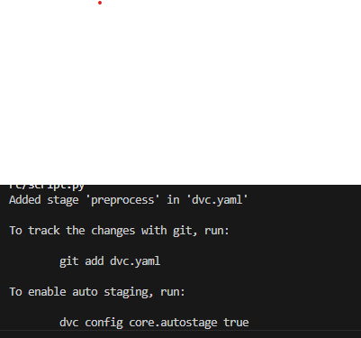
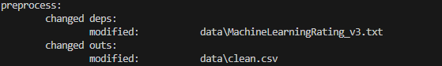
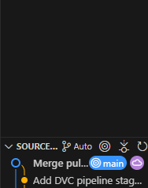
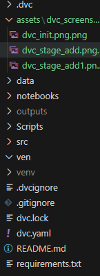

# AlphaCare Insurance Solutions Risk Analytics
## Project description

This project analyzes historical car insurance claim data in South Africa to optimize marketing and pricing strategies. The analysis includes EDA, hypothesis testing, and predictive modeling.

## Tasks:
- EDA & Stats
- DVC Pipeline
- A/B Hypothesis Testing
- Machine Learning Modeling
### Structure
- /data: Raw & processed data
- /notebooks: Jupyter notebooks
- /scripts: Reusable Python code
- /outputs: Plots & results
### Requirements
- pandas
- seaborn
- matplotlib
- scikit-learn
- statsmodels
- dvc 

# 📊 Task 1: Git Setup & Exploratory Data Analysis (EDA)

---

## 📌 Objective

This task focuses on establishing a solid foundation for the project by:

- Setting up **version control** using Git and GitHub with CI/CD via GitHub Actions.
- Performing a comprehensive **Exploratory Data Analysis (EDA)** to understand the insurance dataset.
- Applying statistical methods and visualizations to uncover insights on risk and profitability.

---

## 🛠️ What Was Done

### 1. Git and GitHub Setup

- Created a Git repository dedicated to the project.
- Established a `task-1` branch to isolate analysis work.
- Implemented continuous integration using **GitHub Actions** to automate code checks and workflows.
- Committed work regularly with descriptive messages to maintain clear version history.

### 2. Exploratory Data Analysis (EDA) & Statistics

- **Data Understanding:**  
  Reviewed dataset structure, verified data types, and assessed data quality including missing values.

- **Descriptive Statistics:**  
  Calculated variability and central tendencies for key numeric variables such as `TotalPremium` and `TotalClaims`.

- **Univariate Analysis:**  
  Visualized distributions using histograms (numerical data) and bar charts (categorical data).

- **Bivariate & Multivariate Analysis:**  
  Explored relationships between variables, including monthly changes in premiums and claims across ZipCodes, using scatter plots and correlation matrices.

- **Outlier Detection:**  
  Identified outliers with boxplots to understand their potential impact on the analysis.

- **Creative Visualizations:**  
  Produced three insightful and visually engaging plots highlighting key trends and patterns related to loss ratios, claim distributions, and geographic trends.

---

## 🔍 Key Insights

- The overall **Loss Ratio** (`TotalClaims` / `TotalPremium`) varies significantly across Provinces, Vehicle Types, and Gender.
- Identified outliers in claim amounts which may influence risk modeling.
- Detected temporal trends in claim frequency and severity over the 18-month period.
- Certain vehicle makes/models show notably higher or lower claim amounts, indicating varying risk profiles.

---

## 📁 Files and Branches

| File/Branch             | Description                          |
|-------------------------|------------------------------------|
| `task-1` (Git branch)    | Branch dedicated to EDA analysis    |
| `eda_analysis.ipynb`      | Jupyter notebook containing EDA code, statistics, and visualizations |
| `.github/workflows/ci.yml` | GitHub Actions CI pipeline configuration |

---

## ✅ Outcome

- The repository is well-structured for collaborative development and version control.
- Comprehensive EDA provides a deep understanding of the dataset’s characteristics and risk factors.
- Solid groundwork laid for subsequent modeling and analysis phases.

---

## 📚 References & Learning

- Applied statistical concepts and data visualization best practices.
- Used Python libraries such as `pandas`, `matplotlib`, and `seaborn` for analysis.
- Integrated automated testing via GitHub Actions to maintain code quality.

---

**Status:** ✅ Task 1 complete and ready for further analysis


# ✅ Task 2: DVC & Workflow Description
This project uses DVC for data and pipeline version control.
## 📌 Objective

Establish a reproducible and auditable data pipeline using [Data Version Control (DVC)](https://dvc.org/), a standard practice in regulated industries like finance and insurance. The goal is to ensure that datasets used in analysis and modeling are versioned and can be reproduced exactly for auditing, compliance, or collaboration.

I created a reproducible DVC pipeline using:
```bash
dvc stage add -n preprocess \
-d src/preprocess.py \
-d data/insurance_data.csv \
-o data/processed_data.csv \
python src/preprocess.py
```

### Step 2: Remote Storage Configuration

A local DVC remote was added with:

```bash
mkdir DVCstorage
dvc remote add -d localstorage ./DVCstorage
```
### Step 3: Data Versioning with DVC

To track the dataset with DVC:

```bash
dvc add data/insurance_data.csv
git add data/insurance_data.csv.dvc .gitignore
git commit -m "Track insurance dataset with DVC"
```

### Step 4: Push to Remote

```bash
dvc push
```
### Step 5: Git + DVC Integration Workflow

I integrate DVC with Git to manage code and data separately but reproducibly:

- `*.csv` files are tracked via DVC.
- `.dvc` metadata files are versioned via Git.
- Collaborators clone the repo and run `dvc pull` to get datasets.


## 🛠️ What Was Done

- **Initialized DVC** in the project to enable data tracking and decouple datasets from Git.
- **Configured a local DVC remote storage** directory to store versioned datasets outside the Git repository.
- **Tracked a dataset** (`machineLearningRating_v3.txt`) using DVC, generating a `.dvc` metadata file.
- **Ignored raw data files** using `.gitignore`, while versioning only the `.dvc` tracking files.
- **Pushed data** to the configured remote using `dvc push`.
- **Committed all configuration and tracking metadata** to Git.
- **Created a dedicated Git branch** (`task-2`) and merged it via a Pull Request to `main`.

---

## 📁 Key Files Committed

| File                                      | Purpose                                      |
|-------------------------------------------|----------------------------------------------|
| `data/machineLearningRating_v3.txt.dvc`   | Tracks the version of the dataset            |
| `.dvc/config`                             | Stores DVC remote configuration              |
| `.dvc/.gitignore`                         | Prevents internal DVC cache files from Git   |
| `.dvcignore`                              | Ignore rules for DVC                         |
| `.gitignore`                              | Prevents raw datasets from being tracked by Git |

---

## ✅ Outcome

- The dataset is now version-controlled and safely stored outside Git history.
- The Git repository remains clean and lightweight.
- Team members or auditors can reproduce exact experiments by using:
  ```bash
  git clone <repo-url>
  dvc pull
  ## 📸 DVC Evidence

Below are screenshots to demonstrate the DVC setup and execution:

### ✅ DVC Init
```





```


# 📈 Insurance Risk Segmentation – Statistical Hypothesis Testing (Task 3)

## 🔍 Objective

This project investigates whether certain customer and regional attributes significantly influence insurance risk. The results will guide strategic segmentation and pricing decisions. Specifically, we test **claim frequency**, **claim severity**, and **margin** across various categorical features to validate or reject key business hypotheses.

---

## 📊 Key Metrics

| Metric             | Definition                                                       |
|--------------------|------------------------------------------------------------------|
| **Claim Frequency** | Proportion of policies with at least one claim (`HadClaim`)     |
| **Claim Severity**  | Average claim amount, conditional on a claim occurring          |
| **Margin**          | Profit per policy: `Margin = TotalPremium - TotalClaims`        |

---

## 📁 Dataset

The dataset includes anonymized transactional insurance data with 52 features per record, such as:

- **Customer attributes**: Gender, Citizenship, Title, Language  
- **Policy details**: Premium, Claims, Product Type, Cover Category  
- **Geographic info**: Province, Zip Code  
- **Derived columns**: `HadClaim`, `Margin`, `ClaimSeverity`  

---

## 🧪 Hypotheses & Tests Conducted

| Hypothesis No. | Null Hypothesis (H₀)                                                           | Test Used              | Result        |
|----------------|---------------------------------------------------------------------------------|------------------------|---------------|
| 1              | There are no risk differences across Provinces                                 | Kruskal-Wallis         | ❌ Rejected    |
| 2              | There are no risk differences between Zip Codes                                | Kruskal-Wallis         | ❌ Rejected    |
| 3              | There are no significant **margin** differences between Zip Codes              | Kruskal-Wallis         | ❌ Rejected    |
| 4              | There are no significant risk differences between Women and Men                | Independent T-Test      | ✅ Retained    |

---

## 📈 Visualizations

Several boxplots and barplots were used to visualize KPI distributions:

- **Margin by Province** – reveals profit differences across regions  
- **Claim Frequency by Province and Gender**  
- **Claim Severity by Gender**  

*Visual insights reinforce statistical test results, enabling clear communication with business stakeholders.*

---

## 📌 Statistical Testing Logic

| Variable Type      | Examples                        | Test Used         | Why?                                                                 |
|--------------------|----------------------------------|-------------------|----------------------------------------------------------------------|
| Categorical (multi)| Province, Zip Code               | Kruskal-Wallis    | Non-parametric comparison across >2 groups                          |
| Categorical (binary)| Gender                          | T-Test (on 0/1)   | Comparing mean claim frequency between 2 groups                     |
| Numerical          | Margin                           | Kruskal-Wallis    | Margin treated as continuous outcome variable                       |

---

## 📢 Key Insights & Business Recommendations

- **Provinces & Zip Codes affect risk** → Regional pricing models are justified.  
- **Profitability varies by area** → Localized margin analysis supports tailored pricing.  
- **No evidence of gender bias** → Avoid using gender for underwriting decisions.  

These findings can guide premium adjustments and risk management, helping the business align **pricing strategies with real-world risk patterns**.

---

## 🛠️ Tech Stack

- **Python (Pandas, NumPy, SciPy, Seaborn, Matplotlib)**
- **Jupyter Notebook**
- **Git & GitHub for version control**

---


---

## 🚀 Git Workflow Summary

- Created branch `task-3` for hypothesis testing
- Merged prior updates from Task 2
- Committed with message: `"Implement A/B testing framework in task3_ab__testing.ipynb"`
- Merged to `main` via pull request

---
# Task 4: Risk-Based Pricing System — Claim Severity & Premium Modeling

## 📌 Project Objective

The goal of this task is to build a dynamic, risk-based pricing system by developing machine learning models that predict:

1. **Claim Severity** (`TotalClaims`) — Estimate financial liability for policies with claims.
2. **Premium Optimization** — Develop a pricing framework that balances risk, expenses, and profit margins.

---

## ⚙️ Workflow Overview

### 1. Data Preparation
- Missing value imputation
- Feature engineering (e.g., vehicle age, regional indicators)
- One-hot encoding for categorical variables
- Train-test split (80/20)

### 2. Modeling Approaches
Implemented and evaluated:
- Linear Regression
- Random Forest Regressor
- XGBoost Regressor

### 3. Model Evaluation
**Metrics used:**
- RMSE (Root Mean Squared Error)
- R² Score

Best model selected based on highest R² and lowest RMSE on the test set.

### 4. Model Interpretability
Used **SHAP (SHapley Additive Explanations)** to:
- Identify top 10 influential features
- Generate feature importance bar plots
- Provide actionable business insights

---

## 🔍 Claim Severity Model

- **Target:** `TotalClaims` (only for policies with claims > 0)
- **Problem Type:** Regression
- **Business Use:** Estimate expected cost of claims for more accurate premium pricing

---

## 🧮 Risk-Based Premium Framework (Advanced)

To optimize pricing:
Premium = (Probability of Claim × Predicted Claim Severity)
+ Expenses + Profit Margin


- **Probability of Claim:** From a classification model (not yet implemented)
- **Claim Severity:** Predicted using regression (this task)
- **Expenses & Profit Margin:** Business-defined constants

> This formula ensures that higher-risk customers are charged appropriately while maintaining profitability.


## ✅ Final Note

This project combines **data-driven insight**, **statistical rigor**, and **business interpretation** to improve insurance segmentation strategies. Results are production-ready and suitable for direct integration into underwriting models.

> 📌 **Author**: Shegaw Adugna Melaku  
> 🕓 **Last Updated**: June 2025  

